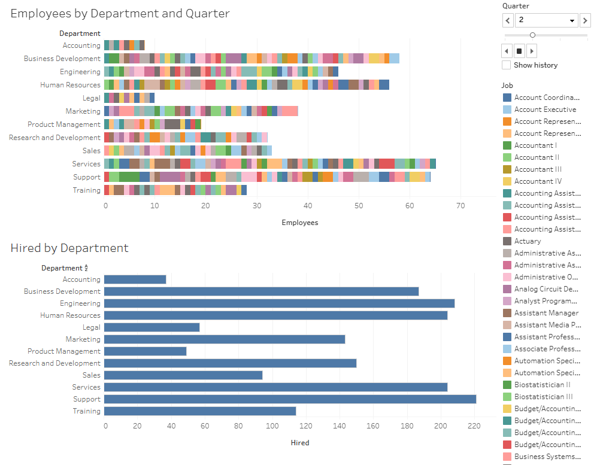

# files-importer-api-v2

## About

This project is part of a technical test for the position of Data Engineer. The main task is to create an API that receives CSV files, loads them into an SQL database, and then performs analytics on the data. The core component is [Tinybird](https://www.tinybird.co/), which simplifies the creation of endpoints using the underlying ClickHouse database. Data can be loaded via REST API with CSV files, but this is not the only method; other options include connections to services like Kafka, Snowflake, BigQuery, among others.

A Lambda architecture is used, which allows querying both updated and historical data when accessing the endpoint via the REST API. Since the CSV files are small and well-structured, no transformations are applied to them. Below is an image of the Lambda Architecture in Tinybird.

Finally, the analytics created is shared via a Tableau Public dashboard available at [Hire and Employees](https://public.tableau.com/views/HiredandEmployees/Dashboard1).

## Usage

**Required Software:**
- Docker
- curl
- make

**Configuration:**
- Create a Tinybird account.
- Obtain the admin token or a token with appropriate privileges.
- Set the token as the `TB_TOKEN` variable in the `.env` file (refer to `.env_example` for an example configuration).

**Execution:**
- Execute the command `make demo`. This command retrieves the `.tinyb` file to obtain credentials, creates data sources, configures pipes, loads data, and generates tokens.
- To remove all configurations and data from Tinybird, run `make clean`.

## Resources

- [tinybird.co/docs/cli/quick-start](https://www.tinybird.co/docs/cli/quick-start)
- [tinybird.co/docs/cli/data-projects](https://www.tinybird.co/docs/cli/data-projects)
- [tinybird.co/docs/cli/install](https://www.tinybird.co/docs/cli/install)
- [tinybird.co/docs/get-data-in/ingest-apis/datasource-api](https://www.tinybird.co/docs/get-data-in/ingest-apis/datasource-api)
- [tinybird.co/docs/v2/get-started/authentication](https://www.tinybird.co/docs/v2/get-started/authentication)
- [tinybird.co/docs/v2/commands/tb-token](https://www.tinybird.co/docs/v2/commands/tb-token)
- [tinybird.co/docs/work-with-data/query/guides/lambda-architecture](https://www.tinybird.co/docs/work-with-data/query/guides/lambda-architecture)
